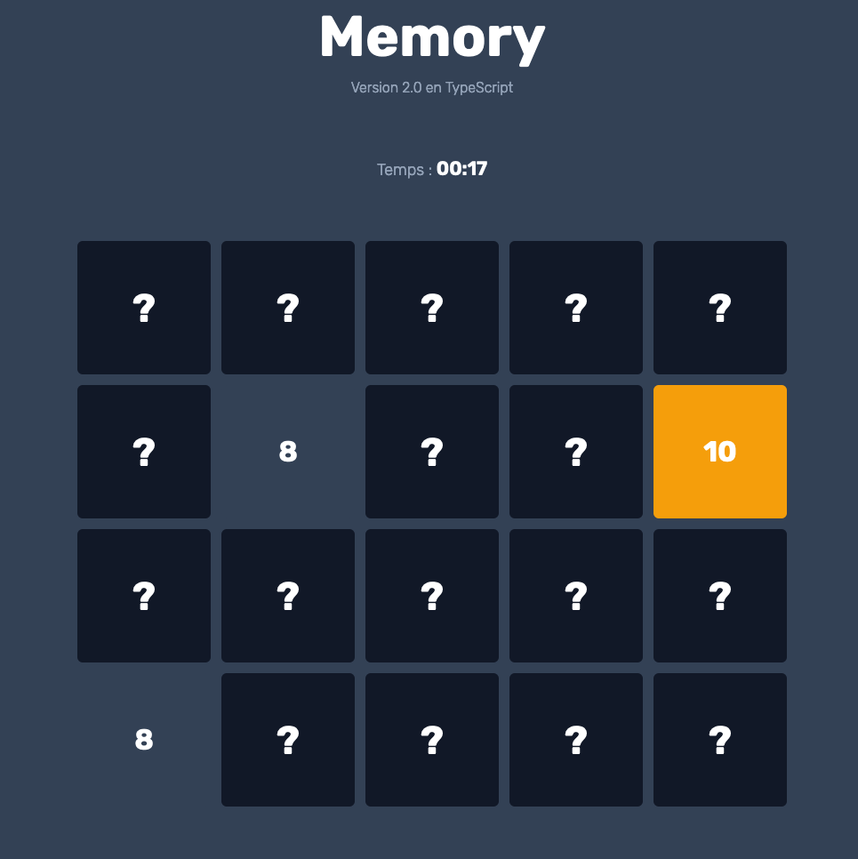

# Memory

Version TypeScript

## Description

Toutes les cartes sont affichées faces cachées. Le joueur doit retourner deux cartes en cliquant sur celles-ci. S'il
s'avère que les deux cartes sont similaires, le joueur "gagne" les cartes et peut en retourner deux autres jusqu'à avoir
trouvé tous les pairs du jeu.

Si les deux cartes ne vont pas ensemble, elles se repositionneront en face cachées.

## Améliorations

Des éléments seront à ajoutés afin d'améliorer l'expérience du jeu et y inclure du challenge comme :
* ~~Un minuteur.~~
* Un système de level.
* Un système de points.
* Choisir le nombre de cartes dans le jeu.

## Screenshots

## Contribution

Ce jeu est un projet gratuit et open source développé pour le plaisir. Voici quelques façons dont vous pouvez aider :
* Signaler les bugs et faire des suggestions.
* Écrire du code. Veuillez suivre le style de code utilisé dans le projet afin d'accélérer le processus de révision.

## License

Cette application est publiée sous licence GNU GPLv3 (voir [LICENSE](https://github.com/wallabag/android-app/blob/master/LICENSE)). Certaines des bibliothèques utilisées sont
publiées sous des licences différentes.
